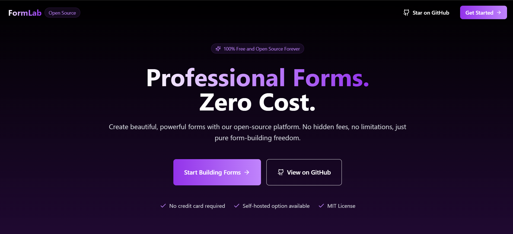
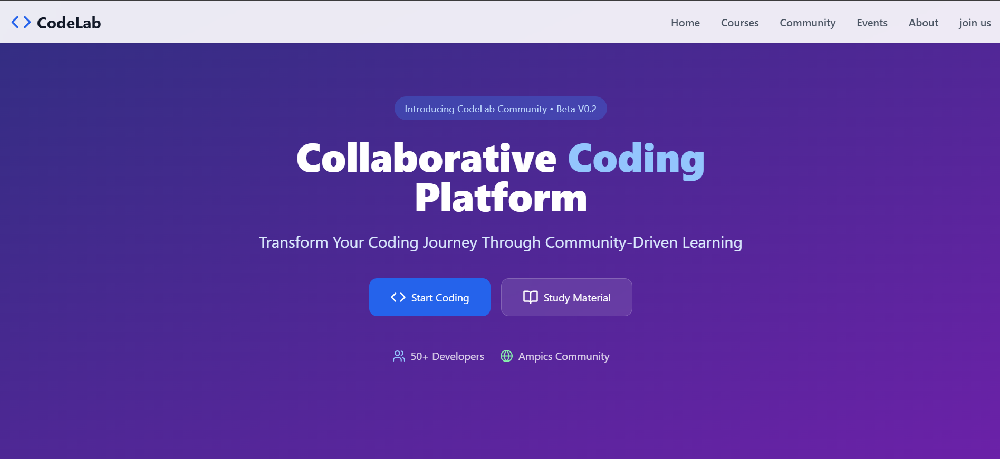

  

<h1 align="center">
  
</h1>

  
  

 

  <!--  -->
  
  ### 🚀 Quick Facts 
  - 🎯 Full Stack Developer specializing in modern web technologies
  - 👨‍💻 Leading CodeLab community with 200+ student developers
  - 🌱 Building with Next.js, React, and Cloud Technologies
  - 🏆 AMPICS Hackathon Solo Runner-up
  - 🤝 Open to collaborating on innovative projects
  - ⚡ Love tackling complex algorithmic challenges

 
<h2 align="center">🛠️ Technology Arsenal</h2>

<b>🎨 Frontend Mastery</b>

 

<b>⚙️ Backend & API Development</b>

 

<b>🗃️ Database & Cloud Infrastructure</b>

 

<b>🧠 AI & Machine Learning</b>

 

---

## 🎯 Featured Projects

<table>
  <tr>
    <td width="50%">
      <h3>FormLab</h3>
      
      

        
        
      

      
Modern form builder with real-time collaboration, built with Next.js, Prisma, and PostgreSQL

    </td>
    <td width="50%">
      <h3>CodeLab</h3>
      
      

        
        
      

      
Educational platform fostering coding excellence through workshops and challenges

    </td>
  </tr>
</table>

## 📊 GitHub Stats

  
  

## 🏆 Achievements

- 🥈 **AMPICS Hackathon Runner-up**: Demonstrated full-stack excellence in solo competition
- 👑 **CodeLab Leadership**: Built and leading a thriving tech community
- 🎯 **Technical Excellence**: Champion at Ganpat University Group Discussion
- 💻 **Open Source**: Active contributor to community projects
- 🌟 **Mentorship**: Conducted 20+ workshops on modern web development 

## 🤝 Let's Connect

  
  
  

  Let's build something amazing together! 🚀

