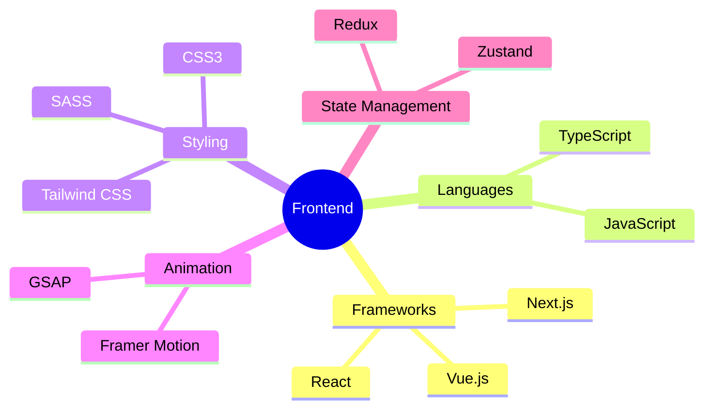
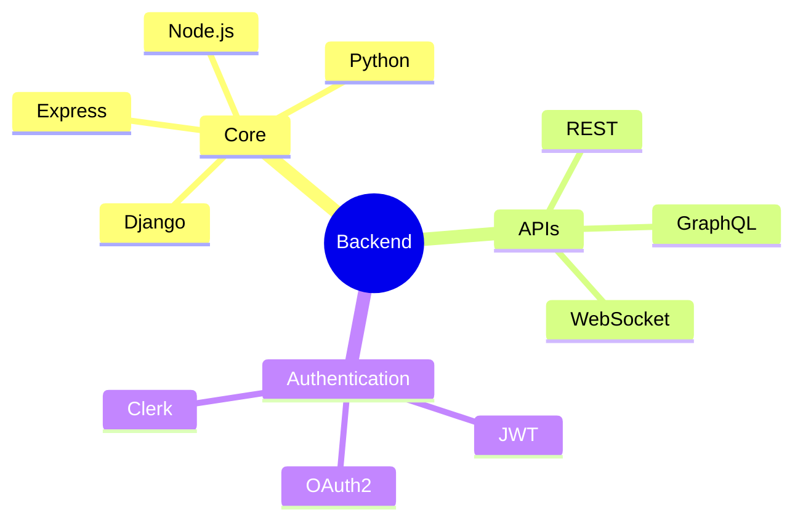
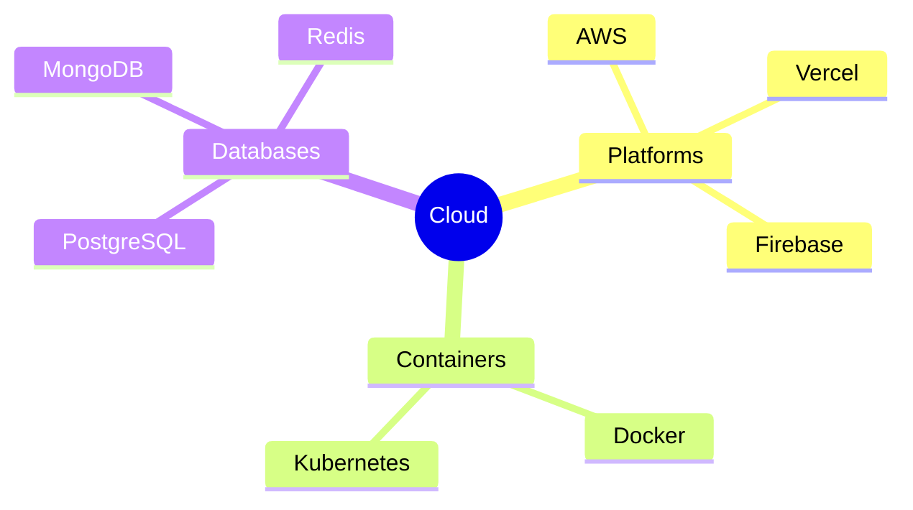
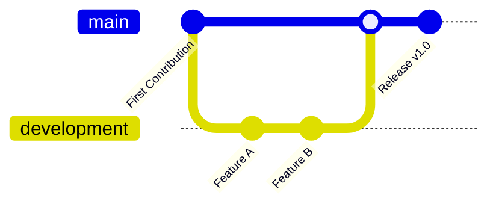
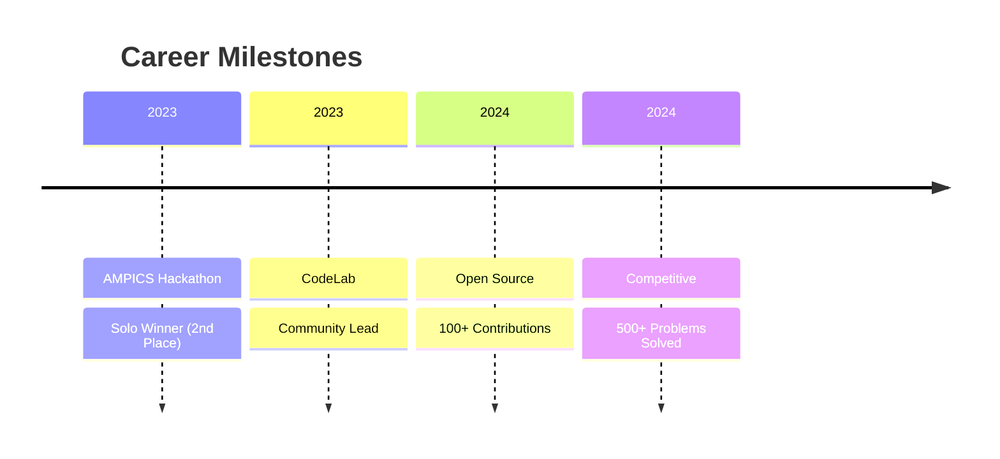

  

<h1 align="center">
  
</h1>

  
  
  
  
  
  

## 💫 About Me

- 🚀 Full Stack Developer crafting seamless digital experiences
- 👨‍💻 Leading CodeLab community of 200+ developers
- 🌱 Mastering Next.js, React, and Cloud Technologies
- 🎯 Focused on building scalable, high-performance applications
- 🤝 Open for exciting collaborations and innovative projects
- ⚡ Love solving complex algorithmic challenges
- 🎨 Passionate about creating intuitive user interfaces

 

## 🛠️ Tech Stack & Tools

<b>🎨 Frontend Development</b>

<b>⚙️ Backend Development</b>

<b>☁️ Cloud & DevOps</b>

## 🚀 Featured Projects

### FormLab - Modern Form Builder
<iframe src="https://formlab.vercel.app" width="100%" height="400px" frameborder="0" scrolling="no"></iframe>

[Live Demo](https://formlab.vercel.app) | [Source Code](https://github.com/Vyas106/FormLab)

### CodeLab - Learning Platform
<iframe src="https://codelab-one.vercel.app" width="100%" height="400px" frameborder="0" scrolling="no"></iframe>

[Live Demo](https://codelab-one.vercel.app) | [Source Code](https://github.com/Vyas106/CodeLab)

## 📊 GitHub Stats

  

## 🏆 Achievements

## 🤝 Let's Connect!

  

---

  Built with ❤️ by Vishal Vyas

